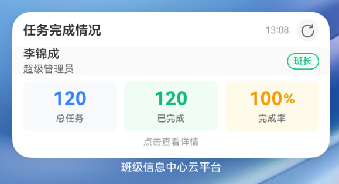

# 班级信息中心云平台 鸿蒙版 V1.0

> **仅供学习参考，未经书面授权，不允许以任何形式转载、售卖、二次开发。**
> 
> 🌟 如果您觉得这套代码有所帮助，请在 GitHub 上为本项目（lijincheng2018/classcenter-harmonyos）点亮 **Star**，谢谢！

## 项目简介

班级信息中心云平台是一款基于鸿蒙操作系统开发的班级管理应用，旨在为师生提供便捷的信息发布、作业管理、通知公告等功能，提升班级信息化管理水平。本项目为V1.0版本，适用于HarmonyOS 5.0设备。

## 软件截图

|                         登录页                          |                         首页                          |
|:----------------------------------------------------:|:---------------------------------------------------:|
|  |  | 


## 卡片截图

|                   桌面任务完成情况2x4小卡片              |
|:----------------------------------------------------:|
|  |


## 鸿蒙版已实现的功能

- **公告查看**：查看平台公告。
- **个人荣誉**：添加、查看、删除个人荣誉信息。
- **个人履历**：添加、查看、删除个人履历信息。
- **成绩查询**：查询考试列表及对应的成绩报告。
- **随机抽号**：随机抽取幸运用户。
- **任务完成情况**：查看任务完成情况。
- **更多功能敬请期待**

## 技术栈

- **前端**：HarmonyOS ArkTS
- **后端**：Java

## 安装与运行

1. **环境准备**
    - 安装 [DevEco Studio](https://developer.harmonyos.com/cn/develop/deveco-studio)（建议使用最新版本）
    - 配置鸿蒙开发环境

2. **获取源码**
   ```bash
   git clone https://github.com/lijincheng2018/classcenter-harmonyos.git
   ```

3. **导入项目**
    - 打开 DevEco Studio，选择“导入项目”并选择本项目文件夹。

4. **配置依赖**
    - 根据项目实际情况安装所需依赖包。

5. **运行项目**
    - 连接鸿蒙真机或启动模拟器，点击“运行”即可体验应用。

## 项目主要结构

```
ClassCenter/
├── AppScope/                           # 应用全局配置与资源
│   ├── app.json5                       # 应用全局配置文件
│   └── resources/                      # 全局资源文件夹（如图标、主题等）
├── README.md                           # 项目说明文档
├── entry/                              # 应用核心代码目录
│   └── src/
│       ├── main/                       # 主程序源码
│       │   ├── ets/                    # 主要业务逻辑与页面
│       │   │   ├── common/             # 公共模块
│       │   │   │   ├── Constants.ets           # 常量定义
│       │   │   │   └── js-md5.d.ts             # MD5 加密工具类型声明
│       │   │   ├── entryability/               # 主入口能力
│       │   │   │   └── EntryAbility.ets        # 应用启动入口类
│       │   │   ├── entrybackupability/         # 备份能力相关
│       │   │   │   └── EntryBackupAbility.ets  # 备份入口类
│       │   │   ├── models/                     # 数据模型
│       │   │   │   └── dataModels.ets          # 业务数据模型定义
│       │   │   ├── pages/                      # 页面组件
│       │   │   │   ├── DocPage.ets             # 个人履历页面
│       │   │   │   ├── ExamPage.ets            # 考试列表页面
│       │   │   │   ├── ExamReportPage.ets      # 考试报告页面
│       │   │   │   ├── HomePage.ets            # 主页
│       │   │   │   ├── Index.ets               # 应用首页/入口页面
│       │   │   │   ├── LoginPage.ets           # 登录页面
│       │   │   │   ├── NoticeDetailPage.ets    # 公告详情页面
│       │   │   │   ├── NoticePage.ets          # 公告列表页面
│       │   │   │   ├── PersonalPage.ets        # 个人信息页面
│       │   │   │   ├── ProductWeb.ets          # 产品网页
│       │   │   │   ├── ProfilePage.ets         # 个人资料页面
│       │   │   │   └── RandomPage.ets          # 随机抽号页面
│       │   │   ├── services/                   # 服务类
│       │   │   │   └── HttpService.ets         # 网络请求服务
│       │   │   └── utils/                      # 工具类
│       │   │       ├── GlobalContext.ets       # 全局上下文管理
│       │   │       └── TokenManager.ets        # Token 管理工具
│       │   ├── module.json5                    # 模块配置文件
│       │   └── resources/                      # 模块资源文件夹
│       ├── mock/                               # 模拟数据（用于开发测试）
│       ├── ohosTest/                           # 鸿蒙平台测试用例
│       └── test/                               # 其他测试用例
├── hvigorfile.ts                              # 构建工具配置文件
├── oh-package-lock.json5                      # 包锁定文件
├── oh-package.json5                           # 项目依赖与配置信息
└── tsconfig.json                              # TypeScript 配置文件
```

## 贡献说明

本项目暂不开放外部贡献。如有建议或意见，请通过 Issue 提交。

## 版权声明

本项目仅供学习参考，未经书面授权，不允许以任何形式转载、售卖、二次开发。

Copyright © lijincheng2018

## 联系方式

如需授权或合作，请联系邮箱：support@classcloud.com.cn

产品简介：https://docs.classcloud.com.cn

---

